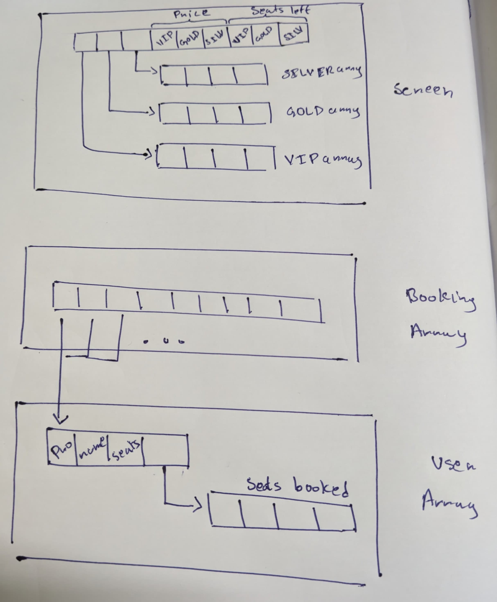

**Project Name**: Ticketing System

**Objective**: Develop a ticketing system to handle selecting screens, booking seats, and blocking seats.

**Scope**: The system includes functionalities for booking seats and blocking seats within different screen categories (VIP, Gold, Silver).

**Data Structures**:
1. **Result**: Used to store the outcome of various operations. Contains:
   - `result_status`: An integer to indicate the status of the operation.
   - `result_message`: A string to provide a descriptive message about the operation.

2. **Seat**: Represents an individual seat in a screen. Contains:
   - `phone`: A string to store the phone number of the person who booked the seat.
   - `name`: A string to store the name of the person who booked the seat.
   - `block`: An integer to indicate if the seat is blocked.

3. **Type**: Represents a category of seats within a screen (VIP, Gold, Silver). Contains:
   - `seat`: A pointer to an array of `Seat` structures.
   - `price`: The price of each seat in this category.
   - `c_size`: The current number of seats in this category.
   - `t_size`: The total number of seats available in this category.

4. **Screen**: Represents a screen with different categories of seats. Contains:
   - `silver`: A pointer to a `Type` structure representing Silver seats.
   - `gold`: A pointer to a `Type` structure representing Gold seats.
   - `vip`: A pointer to a `Type` structure representing VIP seats.

**Functions**:
1. **init_screen**:
   - **Description**: Initializes a `Screen` structure with given Gold, Silver, and VIP seat types.
   - **Parameters**: `Type gold`, `Type silver`, `Type vip`
   - **Returns**: A pointer to a newly created `Screen` structure.

2. **add_screen**:
   - **Description**: Adds a new screen configuration with specified Gold, Silver, and VIP seats.
   - **Parameters**: `Type gold`, `Type silver`, `Type vip`, `Result *result`
   - **Returns**: An integer indicating success or failure of the operation.

3. **display_screen**:
   - **Description**: Displays the details of a `Screen`, including the number and pricing of seats in each category.
   - **Parameters**: `Screen *screen`
   - **Returns**: An integer indicating success or failure of the operation.

4. **book_seat**:
   - **Description**: Books a seat in a given category and updates the seat details.
   - **Parameters**: `Screen *screen`, `Type *type`, `Seat data`, `Result *result`
   - **Returns**: An integer indicating success or failure of the operation.

5. **total_price**:
   - **Description**: Calculates the total price for a given number of seats in a specified category.
   - **Parameters**: `Screen *screen`, `Type *type`, `char data`, `Result *result`
   - **Returns**: An integer indicating the total price or an error code.
